for all questions, see [[../code/main.py]]
# Question 1
## Define the main components of an FSM and their use

- "Character" input (single character symbols from a specified alphabet)
- States (specified)
    - start and accept (distinguished states)
- Transitions on specified characters
$$ \text{states: } S, \text{initial state: } S_0 \in S \text{Accept states} S_{yes} \subset S \text{ language: } \delta:(State, input \in A) \implies nextState \text{Alphabet: } A$$

## Describe how a basic automatic door with pressure plates can be represented

- Door has 2 states
    - open
    - closed

- behavior:
    - Normally closed, (start state)
    - opens on presence of a person (pressure plate signal)
    - Could close on pressure plate signal from OTHER side
	    - In this case we need seperate states for each direction

# Question 2

## List all possible states
$$S = \{s_1, s_2, s_3\}; S_{yes} = \{S_2\}$$
## Write the transition table
|     | 0   | 1   |
| --- | --- | --- |
| S1  | S2  | S3  |
| S2  | S3  | S2  |
| S3  | S2  | S2  |

## Show that is accepts 
### 10100
$$\text{Begin at }s_1, 1 \implies s_2, 0 \implies s_3, 1 \implies s_2, 0 \implies s_3, 0 \implies s_2 \text{ Thus we reach accept state}$$
### 0001
$$\text{Begin at } s_1, 0 \implies s_1, 0 \implies, s_1, 0 \implies s_1, 1 \implies s_2 \text{Thus we reach accept state}$$

## What type of input does this machine accept?
	Any input ending with a 1 and an even number of zeros, that is $*1(00)*$

# Question 3

## List all the states
$$S = \{s_1, s_2, s_3, s_4, s_5\}; S_{yes} = \{s_2, s_4\}; A = \{0, 1\}$$
## Write the transition table
| -     | 0     | 1     |
| ----- | ----- | ----- |
| $s_1$ | $s_4$ | $s_2$ |
| $s_2$ | $s_3$ | $s_2$ |
| $s_3$ | $s_3$ | $s_2$ |
| $s_4$ | $s_4$ | $s_5$ |
| $s_5$ | $s_4$ | $s_5$      |

## Show it accepts
### 101
$$\delta(s_1, 1) = s_2; \delta(s_2, 0) = s_3; \delta(s_3, 1) = s_2; s_2 \in S_{yes} \therefore \text{accepted}$$
### 00
$$\delta(s_1, 0) = s_4; \delta(s_4, 0) = s_4; s_4 \in S_{yes} \therefore \text{accepted}$$

## What type of strings does this machine accept?
Strings that end with the same character they begin with, e.g.
$$1 \ || \ 0 \ || \ (1.*1) \ || \ (0 .*0)$$ 
# Question 4
## only accepts even 0s

## only accepts odd ones

## Union of these machines
|       | 0     | 1     | Labels and notes                      |
| ----- | ----- | ----- | ------------------------------------- |
| $s_1$ | $s_3$ | $s_2$ | Start, Accept: even zeroes, even ones |
| $s_2$ | $s_4$ | $s_1$ | Accept: Even zeroes, odd ones         |
| $s_3$ | $s_1$ | $s_4$ | Reject: odd zeroes, even ones         |
| $s_4$ | $s_4$ | $s_3$ | Accept: odd zeroes, odd ones          |

# Question 5
- Efficient to implement, just a tiny amount of volatile storage and a couple of lookup tables
	- $n$ states can be stored in $\lceil{\log_2} n \rceil$ bits of volatile storage
	- up to $n\times |A|$ transitions can be stored in a table of size $n \times |A| \times \lceil \log_2 n \rceil$ bits
		- Indexable with a $\lceil \log_2 n\rceil + \lceil \log_2 |A| \rceil$ bit address
	- Might need another lookup tables ($n$ entries) to convert $states \implies actions$
	- Can possibly write meta-level control code and then the FSM itself is just a table of input
- Fixed (and limited) functionality
	- Can only count to $\le n$ 
		- You can't do bracket matching
	- Can match predefined patterns very well
	- Regular languages only have up to $n$ equivelance classes
		- For example an FSM can't recognise "an arbitrary number of 'a's followed by an equal amount of 'b's"
	- Can only go forwards at a rate of one character at a time
		- No skipping forward, no going back

# Question 6
- Say league of legends minion (MOBA example)
- $S = \{S_1 =\text{Walk to enemy nexus}, S_2 = \text{attack player}, S_3 = \text{attack minion}, S_4 = \text{attack building}\}$
- $S_{init} =S_1 =  \text{Walk to enemy nexus}$
- $S_{yes} = \emptyset \text{ That is, there is no accept state for this machine}$
- $A = \{ 1 = \text{See enemy minion}, 2 = \text{See enemy player}, 3 = \text{See enemy building}, 4 = \text{enemy player hits ally player}, 5 = \text{target goes too far out of range}\}$

|      | 1     | 2     | 3     | 4     | 5     |
| ---- | ----- | ----- | ----- | ----- | ----- |
| $s1$ | $s_3$ | $s_2$ | $s_4$ | $s_2$ | $s_1$ |
| $s2$ | $s_2$ | $s_2$ | $s_2$ | $s_2$ | $s_1$ |
| $s3$ | $s_3$ | $s_2$ | $s_3$ | $s_2$ | $s_1$ |
| $s4$ | $s_4$ | $s_2$ | $s_4$ | $s_2$ | $s_1$ |

